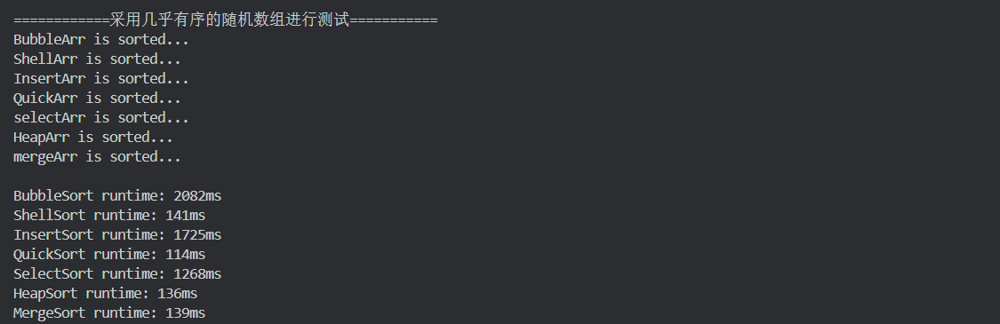

# 编译

```Cpp
mkdir build

cd build

cmake ../

make

./main
```

# 测试结果

采用随机数组进行的测试


采用接近有序的随机数组进行测试



# 讲解

## 直接插入排序

### 算法思想

每次将一个待排序的记录按其关键字大小插入到前面已排好序的子序列中，直到全部记录插入完成。

### 算法实现

```Cpp
void InsertSort(int *arr, const int n) {
    int i, j, temp;

    for (i = 1; i < n; ++i) {
        if(arr[i] < arr[i - 1]) {
            temp = arr[i];
            for (j = i - 1; j >= 0 && arr[j] > temp; --j)
                arr[j + 1] = arr[j];
            arr[j + 1] = temp;
        }
    }
}
```

### 性能分析

- 空间复杂度：O(1)

- 时间复杂度
    - 最好：原本就有序 O(n)
    - 最坏：原本逆序 O(n^2)
    - 平均：O(n^2)

- 稳定性：稳定

## 希尔排序

### 算法思想

先将待排序分割成若干形如 `L[i, i+d, i+2d, ..., i+kd]` 的 “特殊” 子表，对各个子表分别进行直接插入排序。缩小增量 d，重复上述过程，直到 d = 1 为止。

### 算法实现

```Cpp
void ShellSort(int *arr, const int n) {
    int d, i, j, temp;
    for(d = n / 2; d >= 1; d /= 2) {
        for(i = d; i < n; ++i) {
            if (arr[i] < arr[i - d]) {
                temp = arr[i];
                for(j = i - d; j >= 0 && temp < arr[j]; j -= d)
                    arr[j + d] = arr[j];
                arr[j + d] = temp;
            }
        }
    }
}
```

### 性能分析

- 空间复杂度：O(1)

- 时间复杂度：未知，但优于直接插入排序

- 稳定性：不稳定

- 适用性：仅可用于顺序表

## 冒泡排序（基于交换的排序）

### 算法思想

从后往前（或者从前往后）两两比较相邻元素的值，若为逆序，则交换它们，直到序列比较完。称这样过程为 ”一趟“ 冒泡排序。最多只需 n - 1 趟排序。

每一趟排序都可以使一个元素移动到最终位置，已经确定最终位置的元素在之后的处理中无需再对比。如：拿排好序的数组是递增序列为例，每一趟都会将未排好序的序列中的最小元素排到已排好序的后面。

如果某一趟排序过程中未发生 ”交换“ ，则算法可提前结束。

### 算法实现

```Cpp
void BubbleSort(int arr[], const int n) {
    int i, j;
    int temp = 0;

    for (i = 0; i < n - 1; ++i) {
        bool flag = false;
        for (j = n - 1; j > i; --j) {
            // j 从倒数第二个开始，j >= i 用于控
            // 制每次循环需要交换的次数。
            if (arr[j - 1] > arr[j]) {
                temp = arr[j - 1];
                arr[j - 1] = arr[j];
                arr[j] = temp;
                flag = true;
            }
        }
        if (flag == false) return ;
    }
}
```

### 性能分析

- 空间复杂度：O(1)

- 时间复杂度
	- 最好：原本有序 O(n)
	- 最差：原本逆序 O(n^2)
	- 平均：O(n^2)

- 稳定性：稳定

- 适用性：顺序表、链表都可以

## 快速排序（基于交换的排序）

### 算法思想

在待排序表 `L[1 ... n]` 中任取一个元素 pivot 作为枢轴（或为基准，通常取首元素），通过一趟排序将待排序表划分为独立的两部分 `L[1 ... k-1]` 和 `L[k+1 ... n]` ，使得 `L[1 … k-1]` 中的所有元素小于 pivot，`L[k+1 … n]` 中的所有元素大于等于 pivot，则 pivot 放在了其最终位置 L(k) 上，这个过程称为一次 ”划分“ 。然后分别递归的对两个子表重复上述过程，直至每部分内只有一个元素或空为止，即所有元素放在了其最终位置上。

### 算法实现

```Cpp
//划分函数
//用第一个元素将待排序序列划分成左右两个部分
int Partition(int *A, int low, int high) {
    int pivot = A[low];
    while(low < high) {
        while(low < high && A[high] >= pivot) --high;
        A[low] = A[high];
        while(low < high && A[low] <= pivot) ++low;
        A[high] = A[low];
    }
    A[low] = pivot;
    return low;
}

//快速排序主体
void QuickSort(int *A, int low, int high) {
    if (low < high) {
        int pivotpos = Partition(A, low, high);
        QuickSort(A, low, pivotpos - 1);
        QuickSort(A, pivotpos + 1, high);
    }
}
```

### 性能分析

算法表现主要取决于递归深度，若每次 ”划分“ 越均匀，则递归深度越低，”划分“ 越不均匀，递归深度越深。

- 空间复杂度
	- 最好：O(n)
	- 最坏：O(log n)

- 时间复杂度
	- 最好：每次划分很平均 O(n^2)
	- 最坏：原本正序或逆序 O(n log n)
	- 平均：O(n log n)

- 稳定性：不稳定

## 简单选择排序（选择排序）

### 算法思想

每一趟在待排序元素中选取关键字最小的元素加入有序子序列。必须进行总共 n - 1 趟处理。

### 算法实现

```Cpp
void SelectSort(int *A, int n) {
    for (int i = 0; i < n - 1; ++i) {
        int min = i;
        for (int j = i + 1; j < n; ++j) {
            if (A[j] < A[min]) 
	            min = j;
	    }
        if (min != i) {
            int temp = A[i];
            A[i] = A[min];
            A[min] = temp;
        }
    }
}
```

### 性能分析

- 空间复杂度：O(1)

- 时间复杂度：O(n^2)

- 稳定性：不稳定

- 适用性：顺序表、链表都可以

## 堆排序（选择排序）

### 算法思想

基于大根堆的堆排序得到 ”递增序列“，基于小根堆的堆排序得到 ”递减序列“。

**堆中的元素存储在数组中时，不能从下标为 0 开始，而是从下标 1 开始存储。**

几个重要的基本操作

- i 的左孩子：2i
- i 的有孩子：2i + 1
- i 的父节点：i / 2
- i 所在的层次：log(n+1) 或 log(n) + 1

若完全二叉树中共有 n 个节点，则

- 判断 i 是否有左孩子：2i <= n ?
- 判断 i 是否有右孩子：2i +1 <= n ?
- 判断 i 是否是叶子/分支节点：i > (n/2)

以大根堆为例：

**建堆**：编号 <= n / 2 的所有节点一次 ”下坠“ 调整（自底向上处理各分支节点）

**调整规则**：小元素逐层 ”下坠“ （与关键字更大的孩子交换）。

**排序**：将堆顶元素加入有序子序列（堆顶元素与堆低元素交换），堆低元素换到堆顶后（最大的元素放到了最末尾），需要进行 ”下坠“ 调整，恢复 ”大根堆“ 的特性，重复上述过程 (n - 1) 趟。

### 算法实现

```Cpp
//将以 k 下标为根的子树调整为大根堆
void HeadAdjust(int A[], int k, int len) {
    //A[0] 暂存子树的根节点
    A[0] = A[k];
    //沿着向下调整该子树，2k 表示左孩子，
    for(int i = 2 * k; i <= len; i *= 2) {
        //右节点存在的情况下，如果左节点小于右节点，
        //那么将下标移到右节点。
        if(i < len && A[i] < A[i+1])
            ++i;
        //如果两个子节点都没有根节点大，不用调整，
        //没有调整，自然就不会影响到大根堆，所以
        //不用再继续查看后面的
        if(A[0] >= A[i]) {
            break;
        }
        else {
            //将大的子节点移到父节点
            A[k] = A[i];
            k = i;
        }
    }
    //根节点最终存放位置
    A[k] = A[0];
}

//建立大根堆
void BuildMaxHeap(int A[], int len) {
    for(int i = len / 2; i > 0; --i)
        HeadAdjust(A, i, len);
}

//堆排序
void HeapSort(int A[], int len) {
    BuildMaxHeap(A, len);
    for(int i = len; i > 1; --i) {
        int temp = A[i];
        A[i] = A[1];
        A[1] = temp;
        HeadAdjust(A, 1, i - 1);
    }
}
```

### 性能分析

- 空间复杂度：O(1)

- 时间复杂度：建堆 O(n)、排序 O(nlog n)。总的时间复杂度 = O(nlog n)。

- 稳定性：不稳定

## 归并排序

### 算法思想

以二路归并为例：

- 若 low < high，则将序列从中间 mid = (low + high) / 2 分开。

- 对左半部分 `[low, mid]` 递归进行归并排序

- 对有半部分 `[mid + 1, high]` 递归进行归并排序

- 将左右两个有序子序列 Merge 为一个

### 算法实现

```Cpp
void Merge(int A[], int B[], int low, int mid, int high) {
    int i, j, k;
    for(k = low; k <= high; ++k)
        B[k] = A[k];
    for(i = low, j = mid + 1, k = i; i <= mid && j <= high; ++k) {
        if(B[i] <= B[j])
            A[k] = B[i++];
        else
            A[k] = B[j++];
    }
    while(i <= mid) A[k++] = B[i++];
    while(j <= high) A[k++] = B[j++];   
}

void MergeSort(int A[], int B[], int low, int high) {
    if(low < high) {
        int mid = (low + high) / 2;
        MergeSort(A, B, low, mid);
        MergeSort(A, B, mid + 1, high);
        Merge(A, B, low, mid, high);
    }
}
```

### 性能分析

- 空间复杂度：O(n)

- 时间复杂度：O(nlog n)

- 稳定性：稳定
